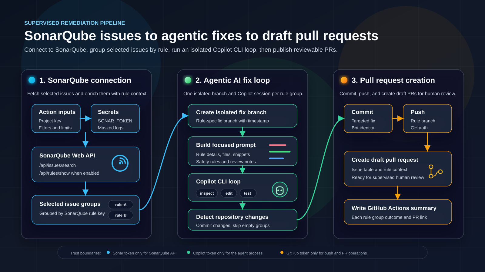

# SonarQube Copilot Fix Action

Reusable Ubuntu composite GitHub Action that fetches selected SonarQube issues, groups them by rule, and handles each rule group in an isolated branch and GitHub Copilot CLI session, producing one draft pull request per successfully fixed rule group.

Use this for supervised remediation of known SonarQube issues.

## Design

The reusable unit is a composite action that runs directly on an Ubuntu runner. The core automation is a .NET 10 C# console app compiled from source with `dotnet run` when the action executes. The action installs its own .NET 10 SDK and pinned standalone GitHub Copilot CLI, while project SDKs installed by preceding workflow steps remain available to Copilot through the runner `PATH`.

This project avoids JavaScript and TypeScript for core logic. C# gives typed SonarQube models, explicit process environments, testable prompt generation, and predictable exit codes.

GitHub-hosted Ubuntu runners are supported. Self-hosted Ubuntu runners are best-effort and must provide Bash, cURL, Git, and GitHub CLI.

## Token Isolation

Use separate secrets:

| Secret | Used for | Never used for |
| --- | --- | --- |
| `SONAR_TOKEN` | SonarQube Web API bearer authentication | Copilot CLI, GitHub CLI, git push |
| `COPILOT_CLI_TOKEN` | Copilot CLI child process only | SonarQube, GitHub API, git push |
| `COPILOT_PROVIDER_API_KEY` | Optional custom Copilot model provider authentication | SonarQube, GitHub API, git push |
| `GH_CLI_TOKEN` | GitHub CLI and repository git operations | SonarQube, Copilot CLI |

All known token values are masked with `::add-mask::`. Child processes receive minimal environment variables; secrets are passed only to the command that needs them.

## Inputs

| Input | Default | Notes |
| --- | --- | --- |
| `sonar_host_url` | required | SonarQube Server or Cloud URL |
| `sonar_project_key` | required | SonarQube project key |
| `components` | empty | Comma-separated component keys; defaults to `sonar_project_key`. Use `projectKey:path/to/file` for source files |
| `sonar_branch` | empty | Sonar branch parameter |
| `sonar_organization` | empty | SonarQube Cloud organization |
| `max_issues` | `10` | Maximum selected issues |
| `statuses` | `OPEN` | Comma-separated statuses |
| `type` | empty | Issue type: `CODE_SMELL`, `BUG`, or `VULNERABILITY` |
| `severities` | empty | Comma-separated severities |
| `impactSoftwareQualities` | empty | Comma-separated software qualities, such as `RELIABILITY`, `SECURITY`, or `MAINTAINABILITY` |
| `impactSeverities` | empty | Comma-separated impact severities |
| `cleanCodeAttributeCategories` | empty | Modern clean-code category filter where supported |
| `rules` | empty | Comma-separated rule keys, such as `csharpsquid:S1234` |
| `include_rule_details` | `true` | Calls `/api/rules/show` per issue |
| `include_code_snippets` | `true` | Reads snippets from checked-out files |
| `code_snippet_context_lines` | `20` | Lines before and after issue line |
| `copilot_model` | empty | Passed to Copilot CLI with `--model`; required when using a custom provider |
| `copilot_provider_type` | empty | Optional Copilot provider type: `openai`, `azure`, or `anthropic` |
| `copilot_provider_base_url` | empty | Optional custom provider base URL, such as an Azure Foundry OpenAI-compatible endpoint |
| `copilot_offline` | `false` | Sets Copilot CLI offline mode for local or private provider scenarios |
| `copilot_extra_instructions` | empty | Added to the prompt |
| `branch_prefix` | `copilot/sonar-fixes` | Generated branch prefix |
| `base_branch` | detected | Uses `origin/HEAD` or `main` fallback |
| `pull_request_draft` | `true` | Draft PRs by default |
| `fail_if_no_issues` | `false` | Strict empty-result behavior |
| `copilot_allowed_tools` | empty | Comma-separated Copilot permission patterns added alongside file writes, such as `shell(dotnet:*)` |
| `copilot_allow_all_tools` | `false` | Allows all CLI tools without confirmation; otherwise only file writes are pre-approved |

## Example Workflow

```yaml
name: Fix SonarQube issues with Copilot

on:
  schedule:
    - cron:  '0 0 * * *'
  workflow_dispatch:

permissions:
  contents: write
  pull-requests: write

jobs:
  fix:
    runs-on: ubuntu-latest

    steps:
      - uses: actions/checkout@v7
        with:
          fetch-depth: 0
          persist-credentials: false

      - name: Setup Python
        uses: actions/setup-python@v6
        with:
          python-version: '3.13'

      - name: Install dependencies
        run: |
          python -m pip install --upgrade pip
          pip install -r requirements.txt
          pip install pytest

      - name: Fix SonarQube issues
        uses: lAnubisl/SonarQubeIssuesAIResolutionAction@v1.0.0
        with:
          sonar_host_url: ${{ vars.SONAR_PROJECT_URL }}
          sonar_project_key: ${{ vars.SONAR_PROJECT_KEY }}
          sonar_branch: main
          statuses: OPEN
          max_issues: 20
          copilot_allow_all_tools: true
          copilot_extra_instructions: |
            Make sure all unit tests are passing after the changes.
            ```bash
            # From the repository root:
            cd python/src
            python -m pytest tests/ -v
            ```
            If any tests are failing, fix them as well.
        env:
          SONAR_TOKEN: ${{ secrets.SONAR_TOKEN }}
          COPILOT_CLI_TOKEN: ${{ secrets.COPILOT_CLI_TOKEN }}
          GH_CLI_TOKEN: ${{ secrets.GITHUB_TOKEN }}
```

## Execution

1. Fetches and paginates open SonarQube issues from `/api/issues/search`.
2. Optionally fetches rule details from `/api/rules/show`.
3. Reads local snippets around affected lines.
4. Requires a clean worktree outside `.sonar-copilot`.
5. Switches to the resolved base branch.
6. Groups selected issues by their SonarQube rule key.
7. For each rule group, creates and checks out a branch named `<branch_prefix>/<sonar_project_key>/<rule_key>/<timestamp>`.
8. Generates a prompt containing every selected issue for that rule and starts a fresh Copilot CLI session with a unique session ID.
9. Detects both uncommitted files and commits created after the per-group snapshot.
10. Commits any remaining worktree changes, pushes the rule-group branch, and creates a draft PR with `gh pr create`.
11. Switches back to the base branch before starting the next rule group.

If neither files nor `HEAD` changed for a rule group, the action skips its empty commit and PR, switches back to the base branch, and continues with the next group. Build, test, lint, and other validation remain the responsibility of the consuming repository's pull request workflows. When Copilot should run a project tool while preparing the fix, install that tool before this action and grant only its required command pattern with `copilot_allowed_tools`.

Configure those workflows for `pull_request` events such as `opened` and `synchronize`, and enforce their checks with branch protection or rulesets. Use a personal access token or GitHub App installation token for `GH_CLI_TOKEN`.

## Copilot CLI Notes

GitHub Copilot CLI access can differ by subscription and enterprise policy. The action intentionally does not accept arbitrary Copilot command input. It invokes the standalone CLI from the repository workspace with a fixed argument shape:

```text
copilot --prompt <prompt> --no-ask-user [--model <model>] (--allow-tool=write[,<permission-pattern>...] | --allow-all-tools) --deny-tool="shell(git commit)"
```

`copilot_allowed_tools` accepts comma-separated Copilot CLI permission patterns. Prefer narrow entries such as `shell(dotnet test)` or `shell(dotnet:*)`. The existing `copilot_allow_all_tools` input remains available as an explicit unrestricted override. The action always denies Copilot's `shell(git commit)` tool, even with `copilot_allow_all_tools`, and supplies a process-scoped Git `pre-commit` hook as a second guard. The generated prompt also tells Copilot to leave changes uncommitted.

## Security

Recommended workflow permissions:

```yaml
permissions:
  contents: write
  pull-requests: write
```
